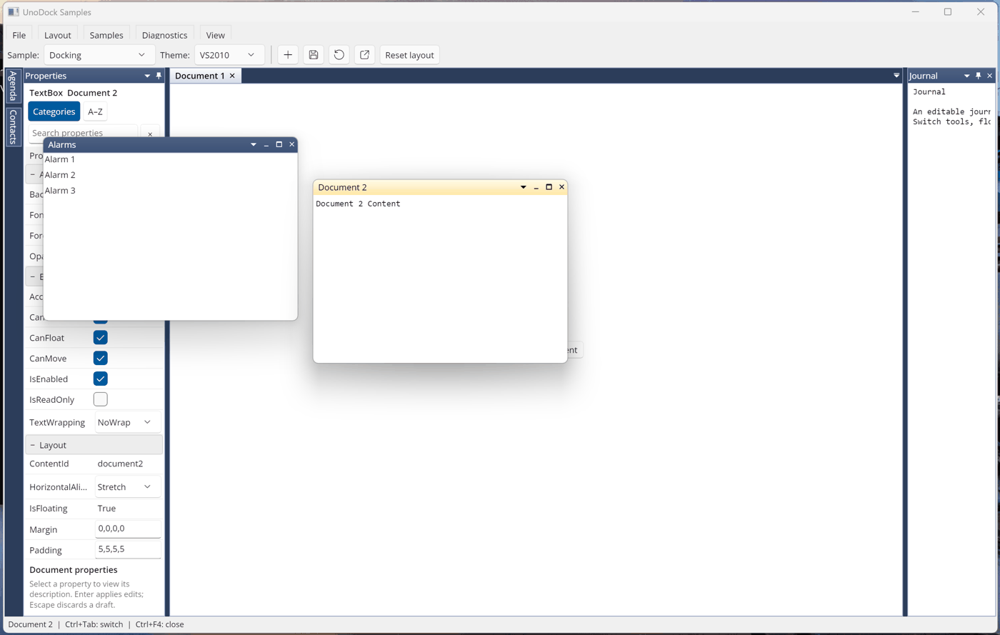
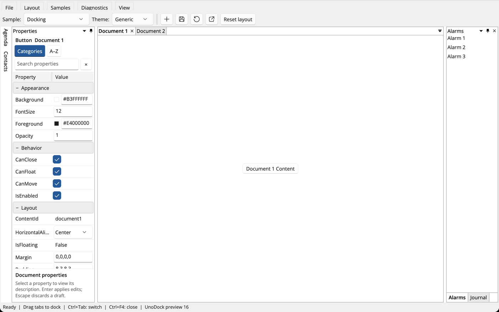
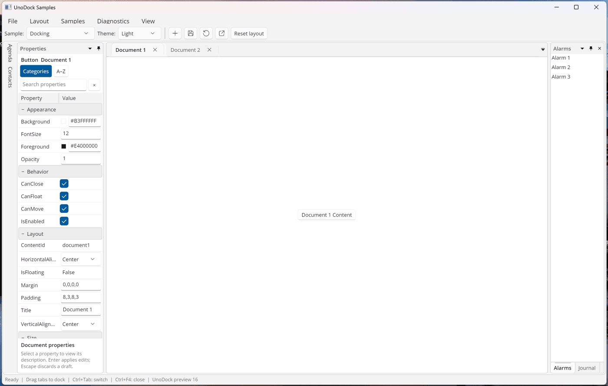
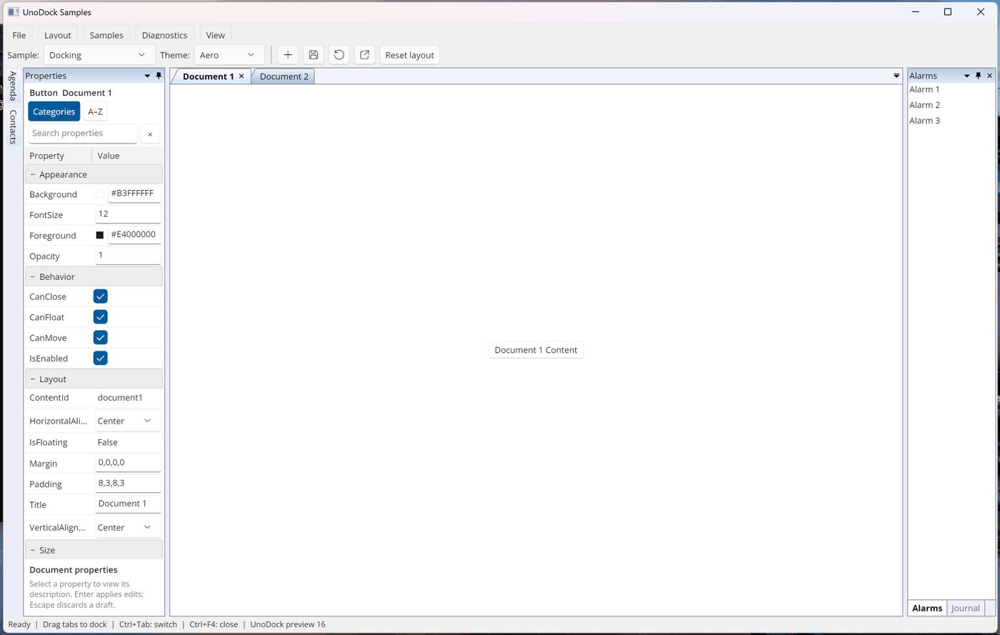
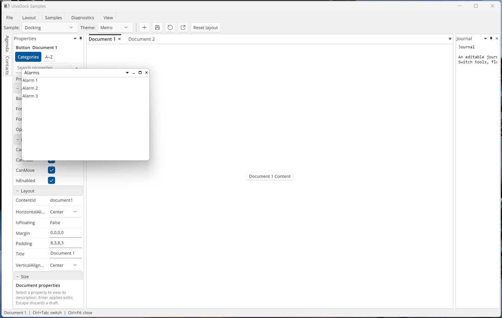
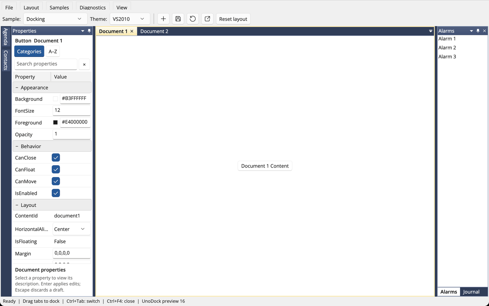
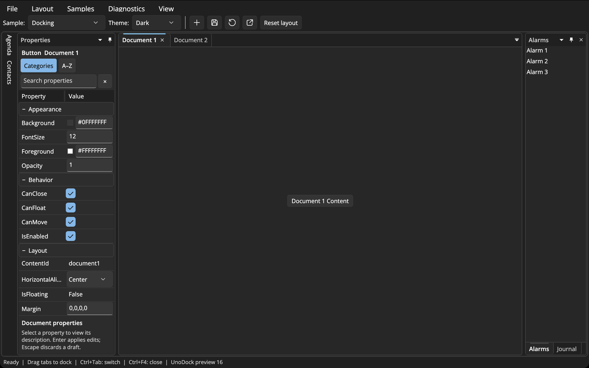

<div align="center">

# UnoDock

**IDE-style docking for Uno Platform applications.**

Documents, tool windows, auto-hide, floating windows and themes for Windows, macOS, Linux and WebAssembly — with a familiar `DockingManager` / `LayoutRoot` API.

[](https://github.com/wieslawsoltes/UnoDock/actions/workflows/ci.yml)
[](https://www.nuget.org/packages/UnoDock)
[](LICENSE)

[**Documentation**](docs/index.md) · [**Getting started**](docs/getting-started.md) · [**Browser workbench**](https://wieslawsoltes.github.io/UnoDock/playground/) · [**Control gallery**](https://wieslawsoltes.github.io/UnoDock/gallery/)



</div>

## Features

- **Complete docking model** — document and tool panes, nested horizontal/vertical splits, tab groups, auto-hide rails with flyouts, hidden tools, and restore to the previous container.
- **Real floating windows** — tool and document windows are native desktop windows with a themed caption (title, window menu, minimize, maximize/restore, close), eight-edge resize, docking guides across windows, and monitor-aware sizing and placement.
- **Continuous tear-off** — drag a tab out of its strip, or a tool pane by its title, and it floats immediately into a window that follows the pointer; drop it on a guide to dock it again.
- **Themes** — Generic, Fluent (Light/Dark/system), Aero, Metro and VS2010, plus optional native WinUI `TabView` document tabs; every chrome state is customizable through resource keys.
- **XAML and MVVM** — declare layouts in XAML, or bind `DocumentsSource`/`AnchorablesSource` with item templates, template selectors, container styles and a layout update strategy.
- **Templates everywhere** — header, title, icon and document-menu templates apply to tabs, captions, the documents list, auto-hide tabs and the Ctrl+Tab navigator.
- **Layout persistence** — `XmlLayoutSerializer` saves and restores layouts, including floating and auto-hidden content, with a callback to reconnect content.
- **Keyboard and accessibility** — Ctrl+Tab navigator, Ctrl+F4, tab and splitter keyboard navigation, context-menu keys, and UI Automation peers.
- **Localized chrome** — English plus Czech, Dutch, French, German, Hungarian, Italian, Japanese, Portuguese, Romanian, Russian, Simplified Chinese, Spanish and Swedish.
- **Browser workspaces** — on WebAssembly, float content into real browser windows and move it between them with ownership-safe transfer and recovery.

## Packages

| Package | Contents |
|---|---|
| [`UnoDock`](https://www.nuget.org/packages/UnoDock) | Docking manager, layout model, controls, Generic and Fluent themes, serialization |
| [`UnoDock.Core`](https://www.nuget.org/packages/UnoDock.Core) | Platform-independent geometry, splitting and placement algorithms |
| [`UnoDock.Themes.Aero`](https://www.nuget.org/packages/UnoDock.Themes.Aero) | Aero theme |
| [`UnoDock.Themes.Metro`](https://www.nuget.org/packages/UnoDock.Themes.Metro) | Metro theme |
| [`UnoDock.Themes.VS2010`](https://www.nuget.org/packages/UnoDock.Themes.VS2010) | VS2010 theme |

```sh
dotnet add package UnoDock --prerelease
dotnet add package UnoDock.Themes.VS2010 --prerelease
```

UnoDock targets .NET 10 with Uno Platform 6.7 (Skia desktop and WebAssembly) and native WinUI 3 on Windows.

## Quick start

```xml
<Page
    xmlns="http://schemas.microsoft.com/winfx/2006/xaml/presentation"
    xmlns:dock="using:UnoDock"
    xmlns:layout="using:UnoDock.Layout"
    xmlns:themes="using:UnoDock.Themes">

    <dock:DockingManager>
        <dock:DockingManager.Theme>
            <themes:FluentTheme />
        </dock:DockingManager.Theme>

        <layout:LayoutRoot>
            <layout:LayoutPanel Orientation="Horizontal">
                <layout:LayoutAnchorablePane DockWidth="240">
                    <layout:LayoutAnchorable Title="Explorer" ContentId="explorer">
                        <TreeView />
                    </layout:LayoutAnchorable>
                </layout:LayoutAnchorablePane>

                <layout:LayoutDocumentPane>
                    <layout:LayoutDocument Title="Program.cs" ContentId="program">
                        <TextBox AcceptsReturn="True" />
                    </layout:LayoutDocument>
                </layout:LayoutDocumentPane>
            </layout:LayoutPanel>
        </layout:LayoutRoot>
    </dock:DockingManager>
</Page>
```

Work with the layout from code:

```csharp
var output = new LayoutAnchorable { Title = "Output", ContentId = "output", Content = new TextBox() };
output.AddToLayout(dockingManager, AnchorableShowStrategy.Bottom);
output.Float();                         // opens a native window over its pane
output.Dock();                          // returns it to where it came from

var documents = dockingManager.Layout.Descendents().OfType<LayoutDocumentPane>().First();
documents.Children.Add(new LayoutDocument { Title = "Notes", ContentId = "notes", Content = new TextBox() });

var serializer = new XmlLayoutSerializer(dockingManager);
serializer.Serialize("layout.xml");     // save…
serializer.LayoutSerializationCallback += (_, e) => e.Content = Resolve(e.Model.ContentId);
serializer.Deserialize("layout.xml");   // …and restore
```

See [XAML and MVVM](docs/xaml-workbench.md) for source-bound documents and tools, and [templates](docs/templates.md) for header, icon and menu templates.

## Themes

| Generic | Fluent | Aero |
|---|---|---|
|  |  |  |
| **Metro** | **VS2010** | **Fluent Dark** |
|  |  |  |

```xml
<dock:DockingManager DocumentTabStripMode="TabView">
    <dock:DockingManager.Theme>
        <themes:VS2010Theme />
    </dock:DockingManager.Theme>
</dock:DockingManager>
```

Every surface — workspace, splitters, tab strips, selected and active tabs, captions, pane frames, rails and floating frames — is a resource key you can override. See [Themes](docs/themes.md).

## Floating windows

Floating tool and document windows are real desktop windows on Windows, macOS and Linux (X11), and in-surface windows in the browser and on mobile. They open where their content was, fit on a visible monitor, and dock back through guides over any window. `DesktopWindowCoordinates` exposes the same top-left, device-independent desktop space for your own windows (`GetWorkAreas`, `SetWindowBounds`, `ToDesktopPoint`). See [Floating windows](docs/floating-windows.md).


## Platform support

| Platform | Host | Floating windows | Validation |
|---|---|---|---|
| Windows 10/11 | Uno Skia (Win32), native WinUI 3 | Native, custom caption | CI + physical input (SendInput) |
| macOS | Uno Skia (AppKit) | Native child windows | CI + Retina runs |
| Linux | Uno Skia (X11/XWayland) | Native, Motif/EWMH/ICCCM hints | CI + XTEST under Openbox |
| WebAssembly | Uno Skia (browser) | In-surface; separate browser windows | Playwright |

Details and known boundaries: [Platform support](docs/platform-support.md).

## Run the samples

```sh
git clone https://github.com/wieslawsoltes/UnoDock.git
cd UnoDock
dotnet run --project samples/UnoDock.Gallery -f net10.0-desktop \
  -p:UnoDockTargetFrameworks=net10.0-desktop -p:UnoDockLibraryFrameworks=net10.0
```

The Gallery shows the classic docking layout, an IDE workspace, MVVM binding, compiled XAML workspaces, every theme (**Theme** picker) and the TabView strip (**View** menu). Environment variables such as `UNODOCK_GALLERY_THEME=VS2010` and `UNODOCK_GALLERY_FLOAT="Alarms"` preset the view.

## Documentation

- [Getting started](docs/getting-started.md) · [Architecture](docs/architecture.md) · [XAML and MVVM](docs/xaml-workbench.md) · [Templates](docs/templates.md)
- [Themes](docs/themes.md) · [Floating windows](docs/floating-windows.md) · [Docking guides](docs/docking-guides.md) · [Localization](docs/localization.md)
- [Browser workspaces](docs/browser-workspaces.md) · [Platform support](docs/platform-support.md) · [Build and verification](docs/testing.md) · [Publishing](docs/publishing.md)

## Building and testing

```sh
dotnet run --project tests/UnoDock.Core.Tests -c Release -- artifacts/core-tests
dotnet build samples/UnoDock.Gallery -c Release -f net10.0-desktop \
  -p:UnoDockTargetFrameworks=net10.0-desktop -p:UnoDockLibraryFrameworks=net10.0
python3 tools/run-desktop-tests.py \
  --app samples/UnoDock.Gallery/bin/Release/net10.0-desktop/UnoDock.Gallery.dll \
  --output artifacts/desktop
```

The desktop runner executes more than 3,000 tests in real Uno hosts, each suite in its own process. See [Build and verification](docs/testing.md) for physical-input suites, the browser tests and the source and API gates.

## Contributing

Issues and pull requests are welcome — please read [CONTRIBUTING.md](CONTRIBUTING.md). UnoDock is an independent implementation; its public API follows a well-known WPF docking library so existing layouts and code patterns carry over, and it is verified against that API's published metadata and observed behavior without reusing its source, templates or artwork (see [clean-room process](docs/clean-room.md)).

## License

[MIT](LICENSE) © Wiesław Šoltés and contributors. Uno Platform and WinUI are trademarks of their respective owners.
