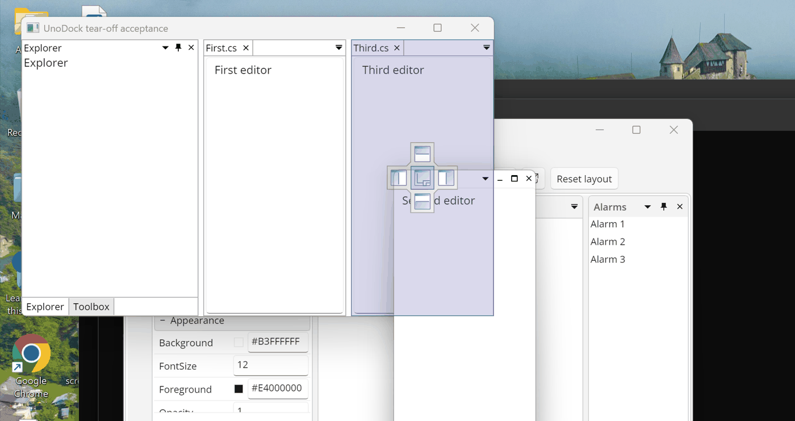
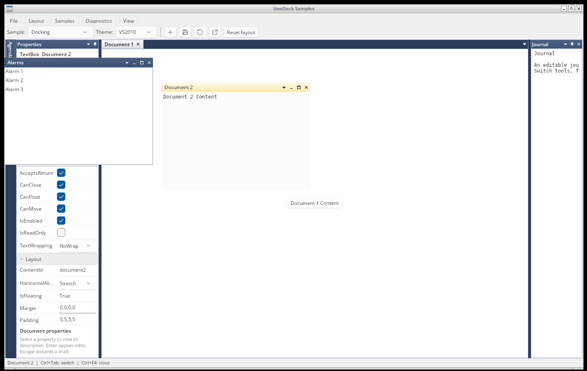

# Floating windows

Tools and documents float into real desktop windows on Windows, macOS and Linux
(X11). The browser and mobile heads use in-surface floating hosts instead.

## Caption

Every floating window draws its own caption, in the active theme's colors:

| Element | Tools | Documents |
|---|---|---|
| Title | Selected tool of a single-pane window | Floating document |
| ▾ Window position | Tool menu (Float, Dock, Dock as Tabbed Document, Auto Hide, Hide) | Document menu (Close, Close All But This, Close All, Float, Dock as Tabbed Document, New Horizontal/Vertical Tab Group) when the theme's `FloatingDocumentMenuButton` is `True` (every theme except Generic) |
| □ / ❐ Maximize / Restore | Yes | Yes |
| × Close | Hides or closes the window's tools | Closes the document |

A floating tool window with a single pane shows its tool title only once: the
pane's own title row is merged into the window caption. Windows with several
panes keep a title row per pane. The caption has no minimize button; minimizing
remains available from the system menu when the window's presenter allows it.
Double-clicking the caption maximizes or restores the window; right-clicking it
opens the system menu.

Caption and frame colors follow window activation through the theme keys
`ToolTitleBrush`/`ActiveToolTitleBrush`, their foregrounds, the caption button
keys (`CaptionButtonForegroundBrush`, `ChromeButtonHover*`), and
`FloatingBorderBrush`/`ActiveFloatingBorderBrush` with
`FloatingBorderThickness` (see [Themes](themes.md)). The classic themes draw a
3–4 pixel frame that changes color when the window becomes active; Fluent and
the automatic palette draw no frame of their own.

## Tearing content off

With native floating windows, dragging behaves like a desktop IDE:

* **A tab** reorders inside its tab strip. Once the pointer leaves the strip,
  the content floats immediately into a new window under the pointer and the
  same gesture keeps moving that window, showing docking guides over every pane
  and workspace edge it passes. Releasing on a guide docks it; releasing
  elsewhere leaves it floating.
* **A tool pane's title** floats the whole pane (all of its tools) and continues
  as a window move in the same way.
* **The only tab of a floating window** moves that window instead of creating a
  new one.
* **Escape** ends the move and keeps the content floating; **Ctrl** suppresses
  docking while held.

Set `DockingManager.ContinuousTearOff = false` to keep drags inside the
workspace; content then floats only when released outside the window. In-surface
floating hosts always use that release behavior.

The window opens with the size of the pane it came from, placed so the pointer
keeps its grip on the caption. `FloatingLeft`, `FloatingTop`, `FloatingWidth`
and `FloatingHeight` are persisted in top-left, Y-down device-independent
pixels on every platform, so saved layouts reopen in the same place on
Windows, macOS and Linux.

## Size and placement

* Content that has never floated opens **over the pane it came from**, sized
  like that pane (at most 80% of the monitor's work area), so it does not jump.
  Remembered floating bounds are reused on later floats.
* New native windows are fitted onto the monitor work area they overlap most,
  or the nearest one when a restored layout points off-screen; oversized
  bounds shrink to the work area. In-surface windows stay inside the
  workspace.
* Releasing a tab outside the workspace opens the window under the pointer.
* Chrome menus (▾ buttons and the documents list) open below their button.

Applications can use the same desktop coordinate space for their own windows:
`DesktopWindowCoordinates.GetWorkAreas(element)`,
`DesktopWindowCoordinates.SetWindowBounds(window, bounds, scale)` and
`coordinates.ToDesktopPoint(element, point)` all use top-left DIPs.

On Windows each monitor keeps its own scale (mixed DPI). A monitor's DIP
rectangle starts at its physical origin and is sized by its own scale, so a
window's bounds convert through the monitor it is on: saved bounds reopen on the
same monitor at the same physical place and size, a single monitor at the
desktop origin maps as pixels ÷ scale, and monitors never overlap in DIPs.
macOS uses AppKit points and Linux the host's single scale.

## Platform notes

* **Windows**: the custom caption replaces the OS title bar; eight-edge resize,
  maximize to the work area and the system menu are supported. Physical input is
  covered by the `windows-floating-input` and `tear-off` suites.
* **macOS**: windows are AppKit child windows of the workspace; frames are
  converted between AppKit's bottom-left space and persisted top-left bounds.
  High-density displays are handled by sizing new windows with the owner's
  scale before the new window has its own.
* **Linux (X11)**: decorations are removed through Motif hints, tool windows
  are marked as utility windows owned by the workspace, and ICCCM position
  hints keep the window manager from re-placing new windows. The `tear-off` suite
  runs with XTEST on a dedicated display. Pure Wayland sessions need XWayland.

Virtual machines without a working GPU driver can run the Gallery with
`UNODOCK_SOFTWARE_RENDERING=1` to select Skia's software rasterizer.
