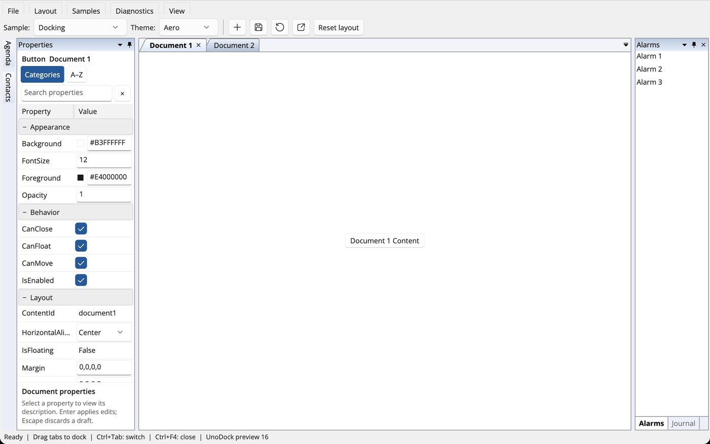
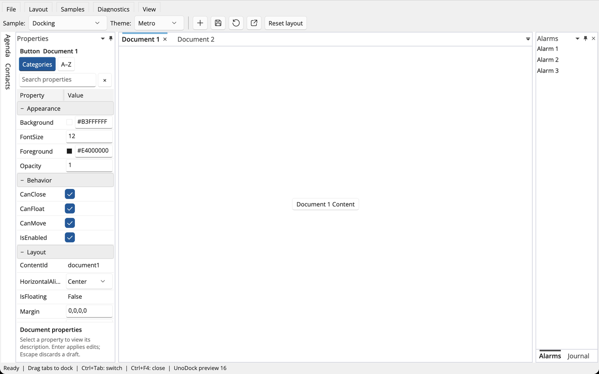
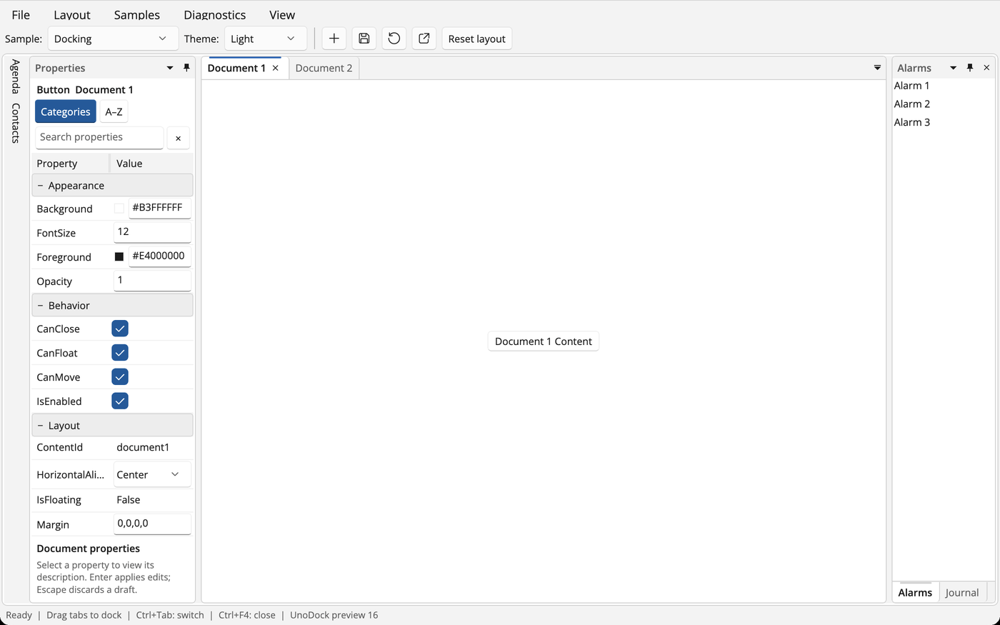
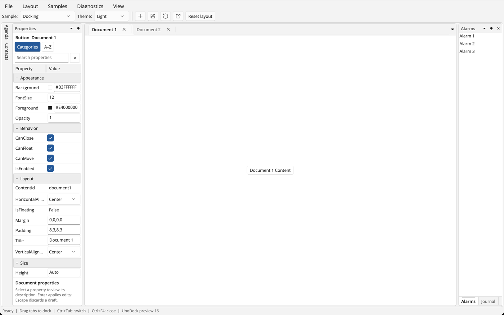

# Themes

UnoDock ships six ready-to-use docking themes. Each one is a `Theme` subclass
assigned to `DockingManager.Theme`; application content is never re-created when
the theme changes.

| Theme | Package | Character |
|---|---|---|
| `GenericTheme` | `UnoDock` | Compact grey classic chrome. |
| `FluentTheme` | `UnoDock` | Uno/WinUI semantic colors; follows Light/Dark or a fixed variant. |
| `AeroTheme` | `UnoDock.Themes.Aero` | Glassy blue captions, slanted document tabs, bold selected title. |
| `MetroTheme` | `UnoDock.Themes.Metro` | Flat white surfaces, hairline borders, accent bar above the active tab. |
| `VS2010Theme` | `UnoDock.Themes.VS2010` | Navy workspace, gold active captions and tabs, a gold band above and below the active document's content. |
| `ResourceDictionaryTheme` / `DictionaryTheme` | `UnoDock` | Your own dictionary of `UnoDock.*` resources. |

```xml
<dock:DockingManager xmlns:dock="using:UnoDock" xmlns:themes="using:UnoDock.Themes">
    <dock:DockingManager.Theme>
        <themes:VS2010Theme />
    </dock:DockingManager.Theme>
</dock:DockingManager>
```

Aero, Metro and VS2010 are fixed light designs: their chrome keeps its colors
when the application or window switches to Dark. The Gallery's **Theme** picker
switches between all of them at runtime.

| Generic | Aero | Metro |
|---|---|---|
|  |  |  |
| **VS2010** | **Fluent Light** | **Fluent Dark** |
|  |  |  |

## Native TabView document tabs

`DockingManager.DocumentTabStripMode = DocumentTabStripMode.TabView` hosts
document tabs in the platform WinUI `TabView`, giving document panes the native
Fluent tab shape, hover, selection, close buttons and overflow scrolling. It
pairs naturally with `FluentTheme`:

```xml
<dock:DockingManager DocumentTabStripMode="TabView">
    <dock:DockingManager.Theme>
        <themes:FluentTheme />
    </dock:DockingManager.Theme>
</dock:DockingManager>
```

Each `TabViewItem` hosts the same docking tab item as its header, so tab
dragging and tear-off, context menus, header/icon templates, keyboard
navigation and automation keep working; tool panes keep the docking strip.
The default, `DocumentTabStripMode.Docking`, draws the theme-painted strip used
by the classic themes. The Gallery's **View** menu switches between them.



## Resource keys

Every theme is a resource dictionary of `UnoDock.*` keys. The same keys can be
placed in `DockingManager.Resources` (followed by `Refresh()`) to override
individual values of any theme.

### Base palette

`PaneBrush`, `HeaderBrush`, `InactiveTabBrush`, `BorderBrush`, `ForegroundBrush`,
`SecondaryForegroundBrush`, `DisabledForegroundBrush`, `HoverBrush`,
`PressedBrush`, `AccentBrush`, `ActiveTitleBrush`, plus the metrics `FontSize`,
`TitleHeight`, `TabHeight`, `ToolTabHeight`, `RailThickness`,
`ChromeButtonSize`, `ButtonCornerRadius`, `ActiveTabIndicatorThickness`,
`TabCornerRadius`, `TabHorizontalPadding` and `PaneCornerRadius`.

### State-specific chrome

These keys are optional. Each falls back to the base slot that historically
painted the same surface, so existing dictionaries render unchanged.

| Key | Surface | Fallback |
|---|---|---|
| `WorkspaceBrush` | Area behind panes | `HeaderBrush` |
| `SplitterBrush` | Splitters | `WorkspaceBrush` |
| `DocumentTabStripBrush`, `ToolTabStripBrush` | Tab strip backgrounds | `HeaderBrush` |
| `DocumentTabBrush`, `ToolTabBrush` | Unselected tabs | `InactiveTabBrush` |
| `SelectedDocumentTabBrush`, `SelectedToolTabBrush` | Selected tabs | `PaneBrush` |
| `ActiveDocumentTabBrush` | Selected tab of the active document | `SelectedDocumentTabBrush` |
| `DocumentTabForegroundBrush`, `SelectedDocumentTabForegroundBrush`, `ActiveDocumentTabForegroundBrush` | Document tab text and glyphs | palette text rule |
| `ToolTabForegroundBrush`, `SelectedToolTabForegroundBrush` | Tool tab text | palette text rule |
| `TabHoverBrush` | Hovered label of an unselected tab (selected and active tabs keep their fill) | `HoverBrush` |
| `TabBorderBrush` | Tab separators and outlines | `BorderBrush` |
| `ToolTitleBrush`, `ActiveToolTitleBrush` | Tool captions, auto-hide flyout captions and floating window captions | `HeaderBrush`, `ActiveTitleBrush` |
| `ToolTitleForegroundBrush`, `ActiveToolTitleForegroundBrush` | Caption text (and caption buttons unless overridden below) | palette text rule |
| `PaneBorderBrush`, `PaneBorderThickness` | Pane frames | `BorderBrush`, `1` |
| `DocumentPaneBorderBrush`, `DocumentPaneBorderThickness` | Frame of a document pane without the active content | `PaneBorderBrush`, `PaneBorderThickness` |
| `ActiveDocumentPaneBorderBrush`, `ActiveDocumentPaneBorderThickness` | Frame of the document pane that owns the active content | `PaneBorderBrush`, `DocumentPaneBorderThickness` |
| `DocumentPaneBorderPlacement` | `Pane` frames the whole pane (tabs included); `Content` frames only the content below the tabs, with no outer frame on tool panes | `Pane` |
| `DocumentPaneFrameCornerRadius` | Corner radius of a `Content`-placed document frame | `0` |
| `ContentBorderBrush` | 1 px hairline directly around pane content | none |
| `SelectedTabIndicatorBrush`, `ActiveTabIndicatorBrush` | Selected-tab indicator | `BorderBrush`, `AccentBrush` |
| `RailBrush`, `AnchorTabBrush`, `AnchorTabForegroundBrush` | Auto-hide rails and their tabs | `WorkspaceBrush`, transparent, text rule |
| `FloatingBorderBrush`, `ActiveFloatingBorderBrush` | Floating window frames (inactive / active window) | `BorderBrush` |
| `FloatingBorderThickness` | Floating window frame width | `0` (no frame) |

Thickness keys (`PaneBorderThickness` excepted) accept a `Thickness`, a uniform
`x:Double` or an `x:String` such as `0,3,0,4` (left, top, right, bottom).

#### Caption and title buttons

Tool-caption, auto-hide flyout, floating-caption and documents-list buttons of
the classic themes use these keys; Fluent keeps the platform `Button` states.

| Key | Meaning | Fallback |
|---|---|---|
| `CaptionButtonForegroundBrush`, `ActiveCaptionButtonForegroundBrush` | Resting glyph on an inactive / active caption; the inactive key also paints the documents-list button | caption foreground |
| `ChromeButtonHoverBrush`, `ChromeButtonPressedBrush` | Hovered / pressed fill | `HoverBrush`, `PressedBrush` |
| `ChromeButtonHoverForegroundBrush`, `ChromeButtonPressedForegroundBrush` | Hovered / pressed glyph | resting glyph, hover glyph |
| `ChromeButtonHoverBorderBrush` | Outline while hovered or pressed | none |

A disabled classic button paints its glyph with `DisabledForegroundBrush`; a
palette without a distinct disabled brush dims the resting glyph instead.

#### Shape and layout options

`DocumentTabShape` (`Rectangle` or `Slanted`), `TabIndicatorPlacement` (`Top` or
`Bottom`), `BoldSelectedTab` (`x:Boolean`), `DocumentTabSpacing` (`x:Double`),
`SelectedTabRaise` (`x:Double`: unselected document tabs sit this much lower than
the selected one), `DocumentTabStripInset` (`x:Double`: space before the first
document tab), `ToolTitleCornerRadius` (`x:Double`: top corners of tool captions)
and `FloatingDocumentMenuButton` (`x:Boolean`: whether floating document windows
show the window-position ▾ button; default `True`).

#### Menus, docking guides, navigator and auto-hide

| Keys | Surface |
|---|---|
| `MenuBrush`, `MenuGutterBrush`, `MenuBorderBrush`, `MenuForegroundBrush`, `MenuDisabledBrush`, `MenuHoverBrush`, `MenuHoverBorderBrush`, `MenuPressedBrush`, `MenuRowHeight`, `MenuMinWidth` | Context menus, caption menus and the open-documents list |
| `GuideBrush`, `GuideBorderBrush`, `GuideAccentBrush`, `GuideFillBrush`, `GuideWindowBrush`, `GuideTitleBrush`, `GuideSelectionBrush`, `GuideSize` | Docking guide compass and edge targets |
| `NavigatorBrush`, `NavigatorBorderBrush`, `NavigatorSelectionBrush`, `NavigatorSelectionBorderBrush`, `NavigatorActiveSelectionBrush`, `NavigatorActiveSelectionBorderBrush` (selection while the navigator has keyboard focus), `NavigatorCornerRadius` (Fluent) | Ctrl+Tab navigator |
| `AutoHideTitleBrush`, `AutoHideTitleHeight` | Inactive auto-hide flyout caption fill (overrides `ToolTitleBrush`) and caption height |

#### Built-in Generic values

`GenericTheme` has no dictionary of state keys; while it is assigned, and only
when neither the application nor another dictionary supplies the key, it uses a
grey inactive / blue active 3 px floating frame, a light-blue caption button
outline, a distinct disabled glyph brush, a 2 px raised selected document tab and
no ▾ button on floating document windows. The automatic palette (no `Theme`)
is unchanged.

Brushes may be solid or gradient. A minimal custom theme:

```xml
<ResourceDictionary xmlns="http://schemas.microsoft.com/winfx/2006/xaml/presentation"
                    xmlns:x="http://schemas.microsoft.com/winfx/2006/xaml">
    <SolidColorBrush x:Key="UnoDock.WorkspaceBrush" Color="#1F2937" />
    <SolidColorBrush x:Key="UnoDock.ActiveDocumentTabBrush" Color="#F59E0B" />
    <x:String x:Key="UnoDock.TabIndicatorPlacement">Bottom</x:String>
</ResourceDictionary>
```

## Authoring a packaged theme

Derive from `Theme`, return the dictionary's `ms-appx:///<Assembly>/<path>` URI
from `GetResourceUri()`, and override `ChromeTheme` to `ElementTheme.Light` or
`ElementTheme.Dark` when the design targets one color scheme. Give each theme
assembly its own root namespace; the public theme class can still live in
`UnoDock.Themes`.

## Verification

The `classic-themes` desktop suite checks that each packaged theme resolves its
dictionary under a dark host, that VS2010 moves the gold tab and content band
with document activation, paints caption buttons with its hover and disabled
brushes and gives the auto-hide flyout caption the tool title states, that Metro's indicator takes the accent only while active,
that Aero's slanted outline follows the arranged tab without widening it, and
that switching back to Generic restores the default chrome while keeping
application content. It also writes one screenshot per theme.

The palettes were authored independently from rendered observations of the
reference themes; no reference XAML, images or color tables are used.
